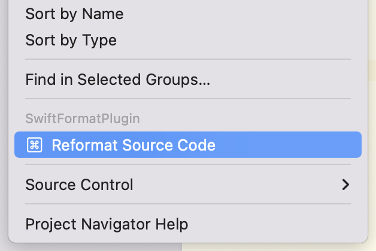

# SwiftFormat Swift Package plugin

Allows to use [SwiftFormat](https://github.com/nicklockwood/SwiftFormat) in Xcode and Swift Package Manager.

## How to use
### In a Swift Package
1. Add to `dependencies` section in your `Package.swift`
2. Use Xcode "File → Packages" main or context menu
3. Or via command line `swift package plugin --allow-writing-to-package-directory format-source-code`

### In Xcode project
1. Add as "Package Dependency" to your project
2. Use Xcode "File → Packages" main or context menu

Based on WWDC'22 sessions: https://developer.apple.com/wwdc22/110359, https://developer.apple.com/wwdc22/110401
Tested in Xcode 14 beta 1.
